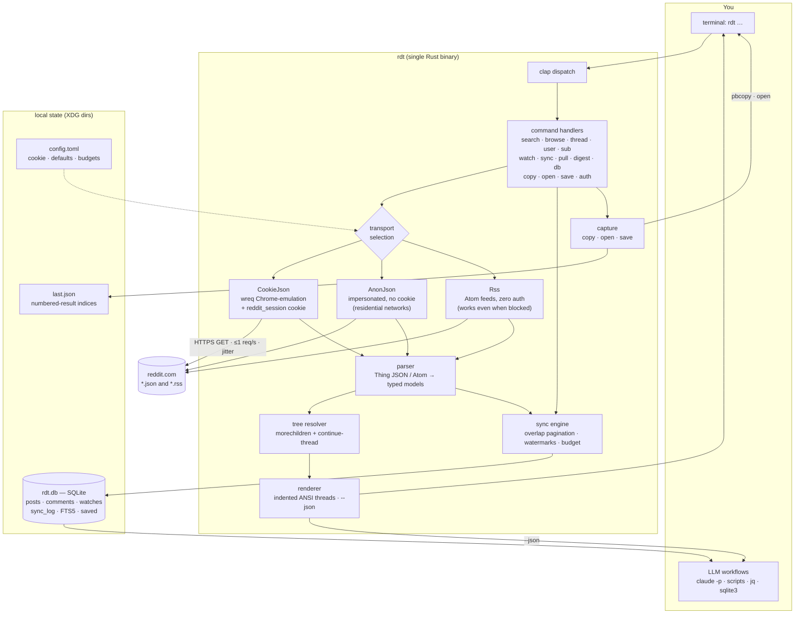
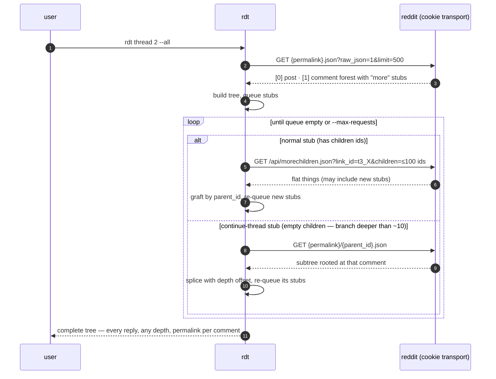
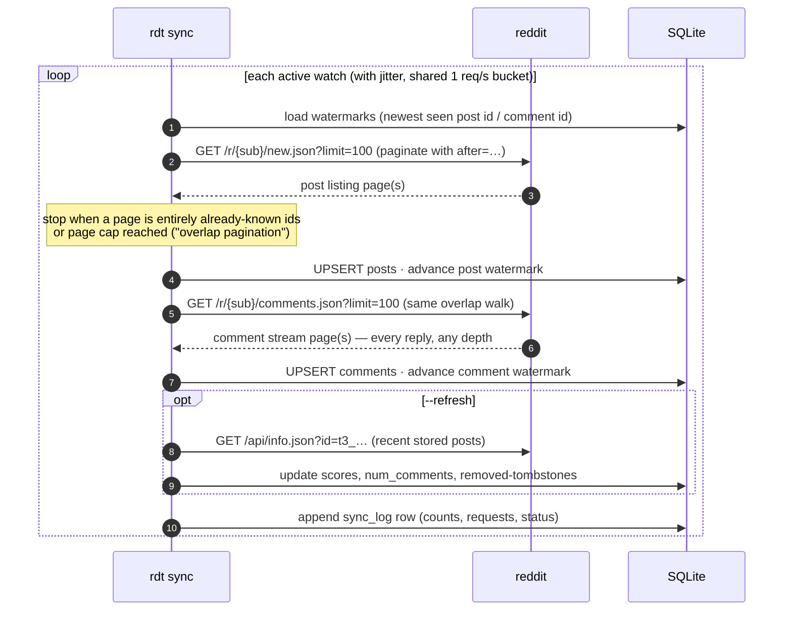
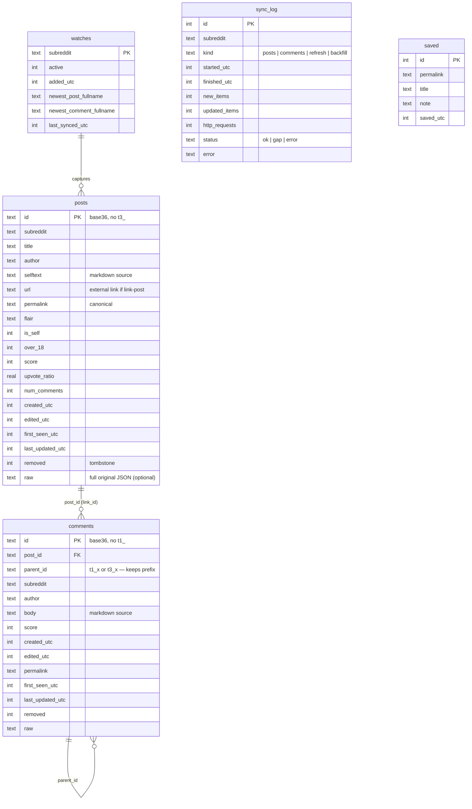

# `rdt` — read-only Reddit CLI · system design

*Design date: 2026-06-11. All endpoint behavior in this doc was empirically verified that day, from this machine, unless marked "verify in M1".*

## 1. Goal & philosophy

A personal, **strictly read-only** CLI for Reddit:

- Search posts across subreddits; browse listings.
- Read whole threads — every reply, at any depth.
- **Watch** chosen subreddits: continuously sync all activity (posts + comments) into a local SQLite database, so LLMs can ingest/summarize structured local data instead of reasoning through Reddit's UI.
- Every rendered item carries its canonical permalink so interesting things can be captured (clipboard / browser / reading list) and **replied to manually** in the browser or app.

Writing is never automated. The tool finds things worth responding to; the human responds.

## 2. Ground truth: how Reddit is actually reachable (verified 2026-06-11)

The naive assumption — "append `.json` to any URL, no auth needed" — is structurally true (the endpoints exist and return full data) but **transport-blocked** in practice from this machine's network:

| Probe | Result |
|---|---|
| `www.reddit.com/*.json`, curl/urllib, bot or browser UA | **403 "Blocked"** (HTML block page) |
| `old.reddit.com`, `api.reddit.com` variants | 403, same |
| `curl_cffi` with full Chrome TLS/HTTP2 impersonation | **still 403** |
| `oauth.reddit.com` without a token | 403 block page (expected; needs bearer) |
| `*.rss` Atom feeds, plain bot UA, no auth | **HTTP 200** ✅ |
| `/r/X/search.rss?q=…&restrict_sr=1` | **200**, real search results ✅ |
| `/r/X/comments/<id>/.rss` | **200**, post + all loaded comments (flat, no parent/depth metadata) |
| `/r/X/comments/.rss` (subreddit-wide comment firehose) | **200**, newest comments across the sub ✅ |

Explanation: this machine egresses via **AS786 (Jisc/JANET — UK academic network)**. Reddit's edge applies IP-reputation blocking to logged-out traffic from institutional/datacenter ranges, beyond TLS fingerprinting. A logged-in browser passes because of its session cookie. RSS paths are exempted (legitimate feed-reader traffic).

Consequences for the design:

1. **Primary transport = browser cookie reuse** (user decision): send the user's `reddit_session` cookie with browser-emulated requests → full `.json` API from any network.
2. **Anonymous JSON** kept as a transport for residential networks (it usually passes there with TLS impersonation).
3. **RSS** kept as a zero-auth degraded fallback that works even on JANET: browse + search + flat comment feeds (no scores, no tree structure).
4. The transport is a trait; an **OAuth app-token transport** (official API, 100 req/min, physically unable to post) is a drop-in upgrade later if cookies prove too fragile.

## 3. Architecture



### Transport selection

Order: **cookie if configured → anonymous JSON → RSS (with a loud "degraded mode" warning)**. A 403 with an HTML body matching Reddit's block page is detected as a typed `EdgeBlocked` error and triggers fall-through; `--anon` / `--rss` flags force a transport. Every JSON request carries `raw_json=1` (avoids `&lt;`-style HTML escaping in bodies).

### Cookie handling (`rdt auth`)

| Source (priority order) | Notes |
|---|---|
| `RDT_COOKIE` env / `cookie` in config.toml | Paste-once from DevTools (`reddit_session` value); long-lived |
| `cookie_file` (Netscape cookies.txt) | For users of cookie-export extensions |
| `rdt auth from-browser [--browser safari\|chrome\|firefox\|arc]` | Extracts via the `rookie` crate, caches into config so Keychain/FDA prompts happen once, not per run |

`rdt auth check` → `GET /api/me.json`; prints the logged-in username and cookie expiry health. `rdt auth clear` wipes it.

Honest risk note: cookie reuse means reads happen *as your account*, the cookie can rotate/expire silently (detected: JSON responses suddenly lacking auth context, or 403s → actionable error message), and sustained polling from a flagged ASN should stay at polite, human-ish rates (see §8). The `Transport` trait keeps the official OAuth app-token path as a clean later upgrade — app-only tokens carry no user identity and *cannot* post, which is the strongest possible enforcement of the read-only rule.

## 4. Command surface

```text
DISCOVERY
  rdt search QUERY [-r sub1,sub2] [--sort relevance|top|new|comments] [--time hour|day|week|month|year|all] [-n N] [--local]
  rdt browse SUB [--sort hot|new|top|rising|controversial] [--time …] [-n N] [--after CURSOR]
  rdt subs QUERY                         # find subreddits
  rdt sub NAME                           # subreddit info (about.json)
  rdt user NAME [--what overview|submitted|comments] [-n N]

READING
  rdt thread URL|ID|N [--all] [--depth D] [--sort best|top|new|controversial|old|qa] [--max-requests M]
  rdt comment URL [--context N]          # one comment with its ancestors

WATCHING → SQLITE
  rdt watch add SUB…   |  rdt watch rm SUB  |  rdt watch ls
  rdt sync [--loop SECS] [--budget N] [--refresh]
  rdt pull URL|ID|N                      # full comment tree of one post → DB (backfill/deep capture)
  rdt digest [--since 24h] [--sub S] [--md|--json]   # LLM-ready export of new activity
  rdt db path | rdt db query "SQL" [--json] | rdt db search QUERY   # FTS5 over everything captured

CAPTURE (the read→reply-manually bridge)
  rdt copy N|URL                         # canonical permalink → clipboard (pbcopy)
  rdt open N|URL                         # open in default browser, reply there
  rdt save N|URL [--note TEXT] | rdt saved

AUTH / GLOBAL
  rdt auth from-browser|check|clear
  --json on every command · --fresh (bypass cache) · --anon/--rss (force transport) · --no-color
```

**Numbered results:** every listing command writes its results to `last.json` in the cache dir; any command accepting `N` resolves it from there. The core loop of the tool is: `rdt search … → rdt thread 2 --all → rdt copy 2 → reply in browser`.

URL inputs accept `www`/`old` URLs, bare base36 ids, `t3_` fullnames, and `redd.it` / `/s/` share links (resolved by following redirects). Output permalinks are always canonical `https://www.reddit.com{permalink}` with tracking params stripped.

## 5. Reddit endpoint map

| Need | Endpoint | Notes |
|---|---|---|
| Browse | `/r/{sub}/{hot,new,top,rising,controversial}.json` | `t=` window for top/controversial; `limit≤100`; `after=` cursor; multireddit `r/a+b` works |
| Search in sub(s) | `/r/{sub}/search.json?q=…&restrict_sr=1` | `sort`, `t`, `after`; RSS twin verified working anonymously |
| Search all | `/search.json?q=…` | |
| Thread | `{permalink}.json` | Returns `[post Listing, comment Listing]`; `limit≤500`, `sort`, `depth`, `context` |
| Expand hidden comments | `/api/morechildren.json?api_type=json&link_id=t3_X&children=id1,…` | Batch ≤100 ids; works logged-in; response = flat `things` grafted by `parent_id` |
| Deep branches ("continue this thread") | `{permalink}/{parent_short_id}.json` | A `more` stub with empty `children`; re-fetch subtree with that comment as root |
| Subreddit comment firehose | `/r/{sub}/comments.json` | Every new comment at any depth, newest-first; **the watch backbone**; RSS twin verified |
| Subreddit info | `/r/{sub}/about.json` | |
| Find subs | `/subreddits/search.json?q=…` | |
| User activity | `/user/{name}/{overview,submitted,comments}.json` | |
| Things by id | `/api/info.json?id=t3_a,t1_b` | Batch hydration (used by `--refresh`) |
| Auth check | `/api/me.json` | Identity of the cookie |

Parsing model: everything is a `Thing` envelope `{kind, data}` — `Listing`, `t1` comment, `t3` post, `t5` subreddit, `t2` user, `more`. Quirks handled in one place (`parse.rs`): `replies` is `""` instead of an object when empty; `edited` is `false | epoch`; deleted content appears as `[deleted]`/`[removed]`; `created_utc` is a float; permalinks are relative.

## 6. Full-depth thread reading (`rdt thread --all`, `rdt pull`)



Budget math: morechildren grafts ≤100 comments per request, so even a 2,000-comment thread is ~1 + 20 requests ≈ 30–40 s at polite pacing. Default `--max-requests 30` with a clear "thread truncated, N comments unfetched" notice when hit.

## 7. Watch subsystem — subreddits → SQLite → LLMs

The key insight: the per-sub **comment firehose** (`/r/{sub}/comments.json`) contains *every* comment at *any* depth, newest-first. So continuous capture needs **no tree crawling at all** — poll two flat streams per sub (`/new` for posts, `/comments` for comments) and the tree structure is reconstructible in SQL from `parent_id`.



Design decisions:

- **Overlap pagination, not `before=` watermarks.** `before=<fullname>` silently breaks if the watermark item gets deleted. Instead: read newest-first with `after` cursors and stop on a fully-known page. Page cap (default 3 → 300 items/stream/sync) bounds cost; a busy sub that outruns the cap logs a gap in `sync_log` rather than failing.
- **Upserts preserve history posture:** `first_seen_utc` never changes; `last_updated_utc`, `score`, `num_comments`, `edited_utc` refresh on re-observation; content observed then gone is tombstoned `removed=1` (the local DB can retain what Reddit no longer shows — a feature for the LLM use case).
- **Cadence:** `rdt sync` is one-shot and cron/launchd-friendly; `rdt sync --loop 600` is a foreground loop with jitter. README will ship a `launchd` plist example (every 10 min). No daemon complexity in v1.
- **Backfill:** the firehose only captures from watch-start onward. `rdt pull <post>` (the §6 resolver writing to DB) deep-captures any specific post; `rdt sync --backfill <sub> --days 2` walks recent `/new` posts and pulls trees, within budget.
- **RSS degraded watch:** on a network where even cookies fail, the verified `.rss` twins keep watch alive with reduced fidelity (no scores, no `parent_id` — post association still recoverable from the comment permalink path). Stored rows are marked `source='rss'`.

### Schema



Plus FTS5 mirrors (`posts_fts` over title+selftext, `comments_fts` over body — rusqlite's bundled SQLite includes FTS5) powering `rdt db search` and `rdt search --local`. Indexes: `posts(subreddit, created_utc DESC)`, `comments(post_id)`, `comments(parent_id)`, `comments(subreddit, created_utc DESC)`. Migrations via a `schema_meta(version)` table.

### LLM consumption paths

1. **Direct SQL** — the DB is the API. Thread reconstruction without Reddit:

```sql
WITH RECURSIVE thread AS (
  SELECT id, author, body, score, 0 AS depth,
         printf('%012d', created_utc) AS path
  FROM comments
  WHERE post_id = :post AND parent_id = 't3_' || :post
  UNION ALL
  SELECT c.id, c.author, c.body, c.score, t.depth + 1,
         t.path || '/' || printf('%012d', c.created_utc)
  FROM comments c JOIN thread t ON c.parent_id = 't1_' || t.id
)
SELECT substr('                        ', 1, depth * 2)
       || '↳ u/' || author || ' (' || score || '): ' || body
FROM thread ORDER BY path;
```

2. **`rdt digest`** — zero-SQL export: new activity since a timestamp, grouped post → top new comments, as Markdown (or JSON), each item carrying its permalink. The intended pipeline:

```sh
rdt sync && rdt digest --since 24h --sub programming \
  | claude -p "Summarize. Flag the 3 threads most worth replying to, with permalinks."
```

3. **`rdt db query "…" --json`** — ad-hoc SQL with JSON output for scripts.

## 8. Politeness, caching, errors

- **Pacing:** global token bucket, default 1 req/s with ±30% jitter; `Retry-After` honored on 429 (one retry, then friendly abort). Sync budget defaults: ≤3 pages/stream, configurable per-sub.
- **Cache:** GET responses cached on disk (cache dir, TTL 5 min, keyed by URL) — repeated browsing is free; `--fresh` bypasses. The sync engine bypasses cache by design.
- **Error taxonomy** (typed, each with an actionable message): `EdgeBlocked` (403 + block-page HTML → suggests transport fallback / `auth check`), `CookieInvalid`, `RateLimited`, `SubPrivate` (403 JSON), `SubBanned` (404), `Quarantined` (needs opt-in; out of scope v1), `NotFound`.
- **Identity discipline:** conservative defaults everywhere because polling runs as the user's account from a flagged ASN. v1 ships with watch cadence ≥10 min and page caps; the doc’s OAuth upgrade path is the escape hatch if Reddit ever tightens further.

## 9. Rust implementation shape

```text
reddit-cli/
  Cargo.toml
  src/
    main.rs            # tokio main, clap dispatch
    cli.rs             # clap derive structs (command surface of §4)
    config.rs          # config.toml + XDG paths (directories crate)
    transport/
      mod.rs           # Transport trait · selection · block-page detection · pacing bucket
      cookie.rs        # wreq client, Chrome emulation profile, cookie header
      anon.rs          # same minus cookie
      rss.rs           # Atom fetch (quick-xml) → degraded models
    auth.rs            # cookie sources, rookie extraction, /api/me.json check
    model.rs           # serde: Thing envelope, Post, Comment, MoreStub, Listing, Page
    parse.rs           # quirks live here (replies:"" , edited:false|f64, floats, relative permalinks)
    resolve.rs         # §6 algorithm: stub queue, morechildren batches, continue-thread splice
    store/
      mod.rs           # rusqlite handle, migrations
      schema.sql       # §7 DDL
      sync.rs          # overlap pagination, upserts, watermarks, sync_log
    render.rs          # ANSI threaded view + --json emitters; numbered results
    actions.rs         # copy (pbcopy) · open (open crate) · save · last.json indices
    digest.rs          # digest builder (md/json)
  tests/
    fixtures/          # captured real responses (listing, thread, morechildren, rss)
    parse_test.rs · resolve_test.rs · sync_test.rs (in-memory SQLite)
```

Crates: `clap` (derive), `tokio`, `wreq` (browser-emulating HTTP — the Rust answer to curl_cffi), `serde`/`serde_json`, `rusqlite` (bundled), `quick-xml`, `directories`, `owo-colors`, `anyhow`/`thiserror`, `jiff` (time + `--since 24h` parsing), `open`; `rookie` behind a `browser-cookies` feature flag.

## 10. Roadmap & verification

| Milestone | Contents | Verified by |
|---|---|---|
| **M1 — transport spike** *(riskiest first)* | wreq + cookie against `/api/me.json`, one listing, one thread; block-page detection; RSS fallback | From *this* network: 200s with cookie; correct username from `me.json`; graceful `EdgeBlocked` → RSS without cookie. **Open questions to settle here:** does a cookie pass with default TLS or is Chrome emulation required? does `/r/X/comments.json` behave with cookie? |
| **M2 — read path** | model/parse/resolve + browse/search/thread/user/sub + renderer + numbered results + copy/open/save | `rdt thread <big-thread> --all --json \| jq '…\| length'` ≈ `num_comments` (±deleted); fixtures-based unit tests; `rdt copy 1 && pbpaste` |
| **M3 — watch + store** | schema/migrations, sync engine, watch/pull/db commands | two `rdt sync` runs 10 min apart: second only inserts the delta; kill -9 mid-sync leaves DB consistent (watermarks advance only after page commit); recursive-CTE query renders a stored thread correctly |
| **M4 — LLM surface + polish** | digest, FTS5 search, `--local`, launchd docs, config defaults, README | `rdt digest --since 24h \| claude -p "summarize"` produces usable output; FTS returns expected hits |

## 11. Risks

- **Cookie fragility** — rotation/expiry breaks silently; mitigated by `auth check`, clear errors, and the OAuth drop-in path.
- **Unofficial surface** — `.json` shapes and edge behavior can change without notice; all Reddit-specific knowledge is quarantined in `transport/` + `parse.rs`.
- **ToS gray zone** — logged-in scraping at low volume mirrors what every third-party client did pre-2023, but it is not the official API; politeness defaults (§8) are the mitigation, OAuth the clean alternative.
- **JANET-wide anonymous block** — anonymous transport will likely never work from the university network; RSS and cookie paths are the realistic ones there.
- **Firehose gaps** — a sub busier than `page_cap × 100` items per sync interval drops items (logged as `gap`); fix by shortening the loop interval or raising the cap for that sub.
